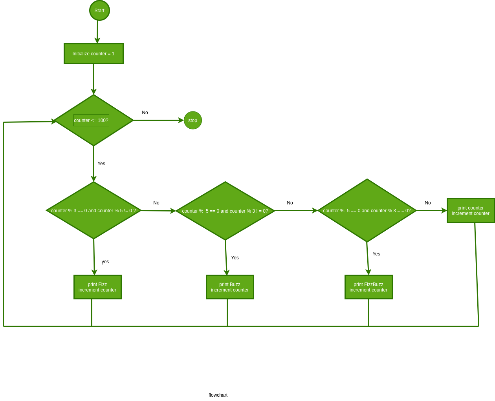

# fizzbuzz

## INTRODUCTION

The fizzbuzz algorithm prints fizz for multiples of 3 only\
buzz for multiples of 5 and \
fizzbuzz for multiples of both 3 and 5
\
This algorithm has been implemented using python3

## Running the code.

Clone the repo and navigate then execute the python file.
```bash
git clone https://github.com/kimengu-david/fizzbuzz
cd fizzbuzz
python fizzbuzz

```


## FLOWCHART

